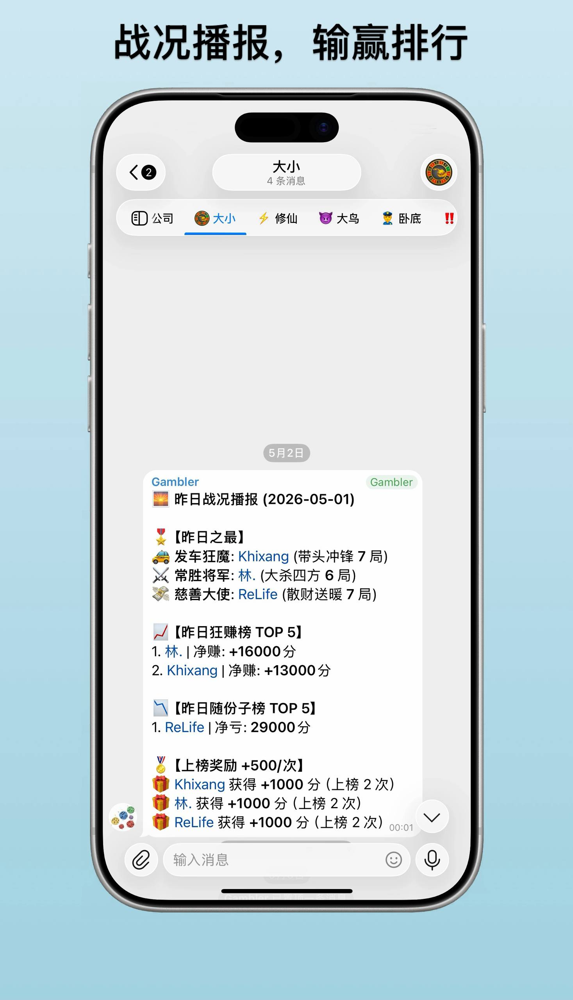
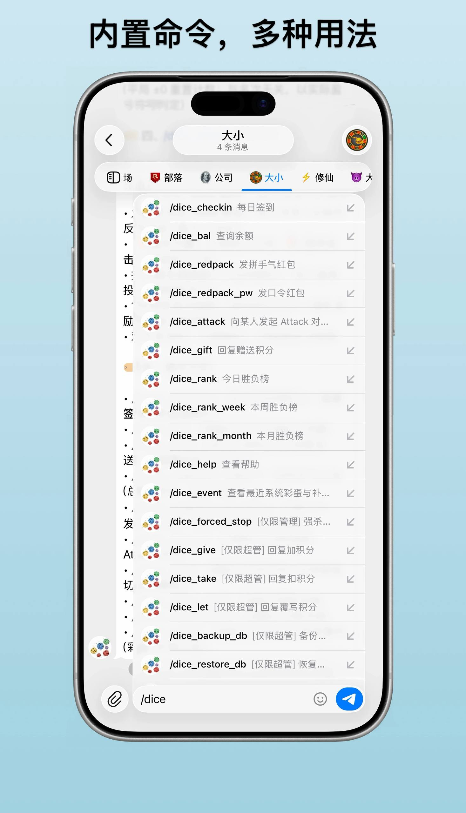
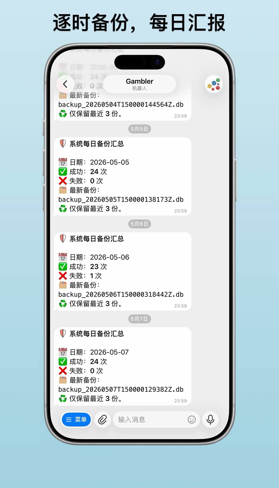
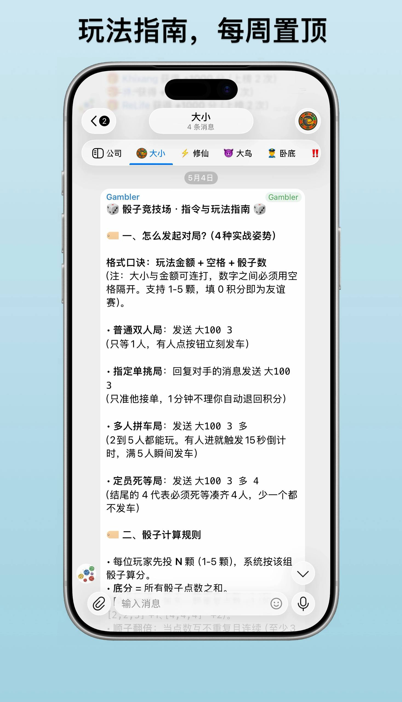

[English](README.md) | [中文](README.zh-CN.md)

# 🎲 Dice Arena Telegram Bot

A full-featured Telegram dice arena group bot supporting multiple game modes, point-based red packets, leaderboards, holiday events, and more. Built with aiogram 3 + Redis + Docker.

## Screenshots

<div align="center">
  
  
  
  
</div>

---

## Feature Overview

### Game System (4 modes)
| Mode | How to Start | Description |
|------|-------------|-------------|
| Open 1v1 | Send `大<wager> <dice>`<br>(e.g. `大100 3` = bet high, 100 pts, 3 dice) | Wait for any one player to accept; starts immediately |
| Targeted Duel | Reply to opponent and send `大<wager> <dice>` | Only the replied player can accept; 1-minute timeout with refund; blocked if target is already in a game |
| Multiplayer Pool | Send `大<wager> <dice> 多` | 2–5 players; 15-second countdown triggered on first join |
| Fixed Squad | Send `大<wager> <dice> 多 <N>` | Waits until exactly N players have joined before starting |

> **Syntax**: `大` = bet high, `小` = bet low, followed by wager amount and dice count (1–5). Append `多` for multiplayer, `多 <N>` for fixed-size squad.

- Supports 1–5 dice; 0-point wager = friendly match
- Lobby panel shows game type, wager amount, and dice count in real time
- Ties automatically trigger tiebreaker rounds until a winner is decided
- Desertion mechanic: throwing timeout counts as an automatic loss

#### Win/Loss Streak Adjustments
- **Win Streak**: 3 consecutive wins (with point gains) → automatic deduction of **20% of average wager (rounded)** from the last 3 games; resets and repeats
- **Loss Streak**: 3 consecutive losses (with point losses) → automatic subsidy of **20% of average wager (rounded)** from the last 3 games; resets and repeats
- Ties (±0) reset the streak counter; win/loss is determined by actual profit sign, not rank
- Streak announcements are pinned messages and are not auto-deleted

#### Extreme Roll Adjustments
- **Roll 0 on High / Roll 9 on Low**: system compensates **20% of wager (rounded)** — only applies if the player did not profit from that game
- **Roll 9 on High / Roll 0 on Low**: payback to society of **20% of wager (rounded)** — only applies if the player did not lose that game
- Extreme roll announcements are pinned and not auto-deleted

### /dice_attack Duel System
Reply to someone's message with `/dice_attack` to challenge them:

- Attacker immediately pays **1,000 points**; both sides can top up repeatedly within 1 minute (+1,000 each time)
- **Increase Intensity** (attacker only) / **Counter Strike** (defender only)
- Higher investment gives a better chance (weighted random), but no guarantee
- Maximum investment per player: **20,000 points**
- Auto-settled after 1 minute: winner recovers principal + seizes **90%** of opponent's investment (10% burned to prevent point farming)
- If opponent does not respond: full refund to attacker with an @mention
- Each player can only have 1 active Attack at a time; each target can only be challenged by 1 Attack at a time

### Points & Red Packets
- **Daily Check-in**: random 100–1,000 points; consecutive 5 days bonus +20,000
- **Gift Points**: `/dice_gift <amount>` — reply to a player to transfer points
- **Lucky Red Packet**: `/dice_redpack <total> <count>` — random amounts, button-grab
- **Password Red Packet**: `/dice_redpack_pw <total> <count> <password>` — must say the password to claim
- **Dice Password Packet**: set password to `🎲` — auto-triggers when participating in a dice game

### Leaderboards
- `/dice_rank` `/dice_rank_week` `/dice_rank_month` — daily / weekly / monthly
- Toggle between "Win/Loss Board" (total won/lost + top 5 win rate + bottom 5 win rate) and "Net Board" (top 5 net winners + top 5 net losers)
- Win rate includes ties: players with profit=0 in 3/5-player games count toward total games
- Daily 00:01 auto-broadcast of yesterday's results; ranked players each receive +500 points

### Automated Tasks
- Hourly point data backup to SQLite (`backup.db`)
- Daily at 12:00: detect holidays (20+ Chinese festivals) and trigger server-wide point bonuses with pinned announcement until 17:00
- Every Monday at 10:00: auto-send help guide to all active groups and pin it

### Admin Functions
- Force-stop stuck games: `/dice_forced_stop` (also reclaims residual game locks)
- Super-admin backup/restore: `/dice_backup_db`, `/dice_restore_db`
- Super-admin balance overwrite: reply to player and send `/dice_let <amount>`
- Super-admin balance increase: reply to player and send `/dice_give <amount>`
- Super-admin balance deduction: reply to player and send `/dice_take <amount>`
- **Maintenance Mode**: super-admin sends `/dice_maintain` → auto-refunds all games, terminates all Attacks with refunds to both sides, returns all red packets, destroys all in-group panel messages, pins maintenance notice, **locks all commands during maintenance** (except compensation)
- **Maintenance Compensation**: super-admin sends `/dice_compensate <update notes>` → server-wide +500 points, lifts maintenance lock, pins compensation notice for 30 minutes

### Topic/Channel Restriction
Lock the bot to a specific group's topic via `ALLOWED_CHAT_ID` + `ALLOWED_THREAD_ID`. Invocations from other locations return an error. Command menus are only pushed to the configured group.

### System Event Log
- `/dice_event`: displays system events from the last 24 hours (holiday bonuses, maintenance compensation), 5 per page with pagination; multi-page panels auto-delete after 1 minute of inactivity; max 200 historical entries

---

## Architecture

```
aiogram 3 (Telegram Bot framework)
  └─ Redis (primary store: points, games, leaderboards, red packets, attacks)
  └─ SQLite backup.db (disaster recovery, synced hourly)
  └─ Docker Compose (one-click deployment)
```

### Module Layout
```
config.py      # Environment variables, constants, concurrency locks
core.py        # bot / dispatcher / redis instances
utils.py       # Utility functions
balance.py     # Point I/O, leaderboard cycle keys
tasks.py       # Scheduled tasks (backup, battle report, holiday events, weekly help)
redpack.py     # Red packet system
game_settle.py # Settlement / roll logic (including streak adjustments)
game.py        # Game flow management
handlers.py    # All /dice_ commands and callback registration (including /dice_attack)
bot.py         # Entry point, blackhole routing, main()
```

---

## Deployment

### 1. Prerequisites

- Docker + Docker Compose
- A Telegram Bot Token (from [@BotFather](https://t.me/BotFather))
- Add the bot to your group with **admin permissions** (needs pin/delete message permissions)

### 2. Clone

```bash
git clone https://github.com/Likhixang/dice_bot.git
cd dice_bot
```

### 3. Configure Environment Variables

Copy the template and fill in real values:

```bash
cp .env.example .env
```

Edit `.env`:

```env
BOT_TOKEN=your_bot_token
BOT_ID=your_bot_numeric_id
SUPER_ADMIN_ID=your_telegram_uid
ADMIN_IDS=uid1,uid2,uid3
RUN_MODE=webhook
WEBHOOK_BASE_URL=https://dc.khixang.dpdns.org
WEBHOOK_PATH=/telegram/webhook
WEBHOOK_PORT=9999
WEBHOOK_SECRET_TOKEN=

# Optional: restrict bot to a specific group's topic (leave empty for no restriction)
ALLOWED_CHAT_ID=your_group_chat_id
ALLOWED_THREAD_ID=topic_thread_id
```

> **How to get your Telegram numeric ID?** Send any message to [@userinfobot](https://t.me/userinfobot).
>
> Run mode: `RUN_MODE=webhook` requires `WEBHOOK_BASE_URL`; falls back to `polling` if not set.

### 4. Start

```bash
docker compose up -d
```

First startup pulls images and installs dependencies (~1–2 minutes).

View logs:

```bash
docker logs dice_bot -f
```

### 5. Stop / Restart

```bash
docker compose down        # Stop
docker restart dice_bot    # Restart bot (after .py changes)
docker compose up -d       # Re-launch (after .env changes)
```

> The project mounts the entire directory as a volume (`.:/app`). After editing `.py` files, just `docker restart dice_bot` — no rebuild needed.

---

## Gameplay Guide

Send `/dice_help` for the full command list.

### Quick Start

1. Send `/dice_checkin` in the group to get initial points
2. Send `大100 3` (bet high, 100 points, 3 dice) to start a game
3. Once someone clicks "Accept", both players roll in turn
4. The final score is derived from "base sum + duplicate bonus + straight multiplier, then take the ones digit" (see rules below)
5. Winner takes the full wager; loser loses their wager

### Dice Scoring Rules

- Each player rolls `N` dice (1–5 dice supported).
- Base score = sum of all dice values.
- Duplicate bonus: +1 for each extra identical value. E.g. `[2,2,5]` → +1, `[4,4,4]` → +2, `[6,6,1,1]` → +2.
- Straight multiplier: when values are all distinct and consecutive (at least 3 dice), the entire result ×2. E.g. `[1,2,3]`, `[2,3,4,5]`.
- Final score = (base sum + duplicate bonus, then straight ×2 if applicable) % 10, yielding a result in 0–9.
- High roll: larger final score wins. Low roll: smaller final score wins.
- Ties trigger sudden-death: tied players each roll 1 extra die per round until a winner emerges; caps at 20 dice total before forced settlement.
- Timeout during roll counts as desertion (automatic loss).

### Payout Rules

| Players | Payout |
|---------|--------|
| 2 | Winner +pot, Loser −pot |
| 3 | 1st +pot, 2nd ±0, 3rd −pot |
| 4 | 1st +pot, 2nd +pot/2, 3rd −pot/2, 4th −pot |
| 5 | 1st +pot, 2nd +pot/2, 3rd ±0, 4th −pot/2, 5th −pot |

---

## FAQ

**Q: Bot is not responding?**
Check that the bot has admin permissions and that `BOT_TOKEN` in `.env` is correct. Also confirm messages are sent in the configured topic (if `ALLOWED_THREAD_ID` is set).

**Q: Redis data lost?**
A super-admin can send `/dice_restore_db` to restore from the latest `backup.db` snapshot.

**Q: Code changes aren't taking effect?**
Run `docker restart dice_bot`. If you changed `.env`, use `docker compose up -d` instead.

**Q: Lunar holiday events not triggering?**
Ensure `lunardate` is in `requirements.txt` and you've rebuilt the image with `docker compose up --build -d`.

---

## Dependencies

```
aiogram==3.4.1
redis==5.0.1
lunardate==2.0.1
```

---

## License

MIT License
